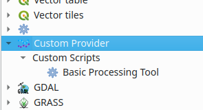

# qgis-basic-geoprocessing-plugin
Basic QGis geoprocessing plugin (to be used as template)

## Install 

* Git clone

    git clone https://github.com/procrastinatio/qgis-basic-geoprocessing-plugin

* Create resources
   cd qgis-basic-geoprocessing-plugin/BasicPlugin
   pyrcc5 resources.qrc -o resources.py

* Install plugin

    cd $HOME/.local/share/QGIS/QGIS3/profiles/default/python/plugins/ && 
       ln -s <path to cloned repository>/qgis-basic-geoprocessing-plugin/BasicPlugin/

* A new tool group and tool in the geoprocessing toolbox

